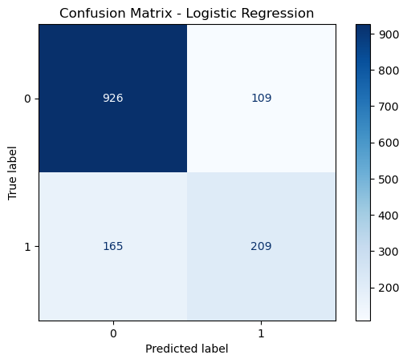
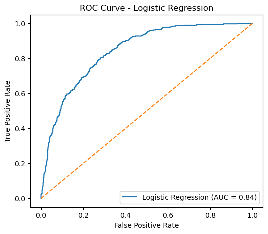

# Customer Churn Prediction (End-to-End ML Project)

## Project Overview

Customer churn is a major business problem. It is much cheaper to retain existing customers than to acquire new ones.

This project builds a machine learning model to predict which customers are likely to leave (churn), using real customer data. The goal is to help businesses act early and reduce churn.

---

## Business Problem

Can we identify customers who are likely to churn before they leave?

If yes, companies can:

* Offer discounts
* Improve service
* Target high-risk customers

---

## Dataset

IBM Telco Customer Churn Dataset

* ~7,000 customers
* Features:

  * Demographics (age, gender)
  * Account info (tenure, contract type)
  * Services (internet, phone)
  * Billing (monthly charges, payment method)

---

## Project Workflow

1. Data Cleaning
2. Exploratory Data Analysis (EDA)
3. Feature Engineering
4. Model Training
5. Model Evaluation
6. Business Insights

---

## Models Used

* Logistic Regression (baseline)
* Decision Tree
* Random Forest

---

## Model Performance

| Model               | Accuracy | Recall (Churn) | ROC-AUC |
| ------------------- | -------- | -------------- | ------- |
| Logistic Regression | 0.81     | 0.57           | 0.84    |
| Random Forest       | 0.79     | 0.51           | ~0.84   |
| Decision Tree       | 0.72     | 0.48           | 0.65    |

---

## Key Insight

The model can help businesses identify high-risk customers early, allowing targeted retention strategies that can reduce revenue loss.

---

## Why Logistic Regression Won

* Best balance of performance + interpretability
* Easy to explain to business stakeholders
* Stable results on this dataset

---

## Limitations

* Dataset is imbalanced (fewer churn cases)
* Recall is moderate → some churn customers are missed
* Model trained on public dataset (may not generalize fully)

---

## Visualizations

### Churn Distribution

### Monthly Charges vs Churn

### Tenure vs Churn

---

## Model Evaluation

### Confusion Matrix (Explain Simply)

* True Positive → correctly predicted churn
* False Negative → missed churn (very important problem)

* 
  

### ROC Curve

* Shows how well the model separates churn vs non-churn
* AUC = 0.84 → good performance

---

## Key Business Insights

* Customers with short tenure churn more
* Month-to-month contracts have highest churn
* Higher monthly charges increase churn risk

---

## Technologies Used

* Python
* Pandas
* NumPy
* Scikit-learn
* Matplotlib

---

## Project Structure

customer-churn-prediction-ml/

* notebooks/ → analysis notebook
* images/ → charts
* README.md → project summary

---

## Future Improvements

* Handle imbalance using SMOTE or class weighting
* Hyperparameter tuning
* Deploy model (Streamlit / FastAPI)
* Build a real-time prediction pipeline
---

## How to Run

1. Clone the repository.
2. Install dependencies using `pip install -r requirements.txt`.
3. Open the notebook `notebooks/01_customer_churn_analysis.ipynb`.
4. Run all cells in order to reproduce the analysis, visualizations, and model results.
---

## Top Churn Drivers

The analysis suggests that the strongest churn indicators include:

- Month-to-month contract type
- Short customer tenure
- Higher monthly charges

These factors are important because they help explain which customers are most likely to leave and where the business should focus its retention efforts.
---

## Business Recommendations

Based on the model results and exploratory analysis, businesses can take several practical actions to reduce customer churn:

- Focus on customers with month-to-month contracts, since they show the highest churn risk.
- Provide retention offers or loyalty incentives to customers with high monthly charges.
- Strengthen onboarding and early support for newer customers, since short tenure is strongly associated with churn.
- Use churn predictions to identify high-risk customers early and target them with proactive customer service interventions.

These actions can help reduce revenue loss and improve long-term customer retention.

---

## Author

Teferi Hagos

Machine Learning Engineer | Data Scientist

GitHub: https://github.com/Teferihagos

Kaggle: https://www.kaggle.com/teferihagos

---
