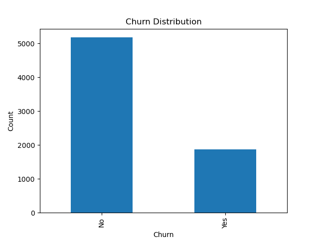
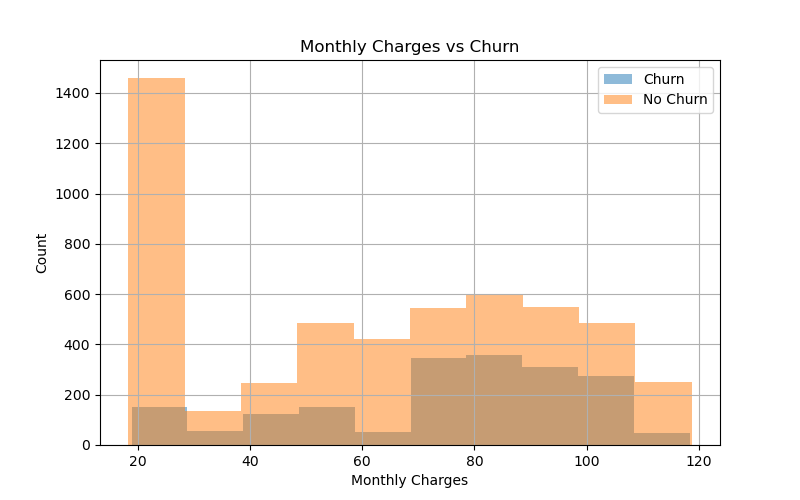
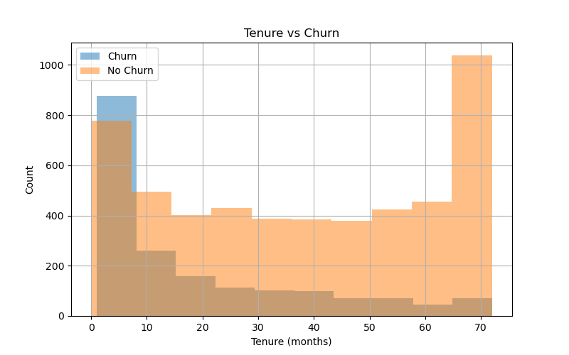
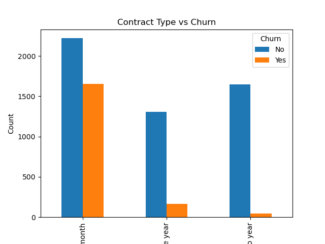
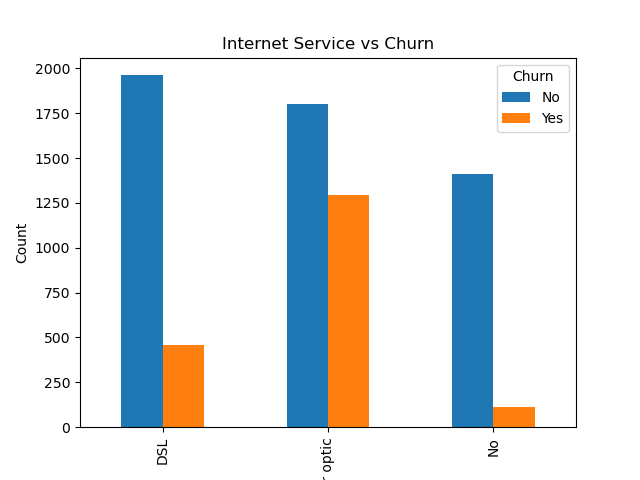
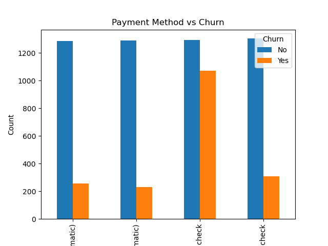

## Project Overview

Customer churn is a critical business problem, as retaining existing customers is often significantly more cost-effective than acquiring new ones.

This project develops a machine learning model to predict customer churn using behavioral, demographic, and account-related features. The goal is to help businesses identify at-risk customers early and take proactive retention actions.

---

## Business Problem

Can we accurately predict which customers are likely to churn using historical customer data?

---

## Dataset

- IBM Telco Customer Churn Dataset  
- ~7,000 customer records  
- Features include demographics, services subscribed, contract details, and billing information  

---

## Project Workflow

1. Data Cleaning and Preprocessing  
2. Exploratory Data Analysis (EDA)  
3. Feature Engineering  
4. Model Training  
5. Model Evaluation and Comparison  
6. Business Insights and Recommendations  

---

## Models Used

- Logistic Regression (baseline model)  
- Decision Tree  
- Random Forest (ensemble model)  

---

## Model Performance

| Model                | Accuracy | Recall (Churn) | ROC-AUC |
|---------------------|---------|----------------|--------|
| Logistic Regression | 0.81    | 0.57           | 0.84   |
| Random Forest       | 0.79    | 0.51           | ~0.84  |
| Decision Tree       | 0.72    | 0.48           | 0.65   |

## Results Summary

Logistic Regression provided the best overall balance between performance and interpretability, achieving an accuracy of 0.81 and ROC-AUC of 0.84. While Random Forest captured more complex patterns, it showed slightly lower recall for churn customers. The Decision Tree performed the worst, likely due to overfitting.

## Limitations

- The dataset is imbalanced, which affects churn prediction performance  
- Recall for churn customers remains moderate, meaning some at-risk customers are missed  
- The model is trained on a relatively small public dataset and may not generalize to real-world scenarios fully.
  

## Visualizations

### Churn Distribution

### Monthly Charges vs Churn

### Tenure vs Churn

### Contract Type vs Churn

### Internet Service vs Churn

### Payment Method vs Churn

---

## Key Insights

- Customers with **short tenure** are significantly more likely to churn  
- **Month-to-month contracts** have the highest churn rates  
- Higher **monthly charges** are associated with increased churn risk  
- The dataset is **imbalanced**, making churn prediction more challenging and affecting recall  

---

## Technologies Used

- Python  
- Pandas  
- NumPy  
- Scikit-learn  
- Matplotlib  

---

## Project Structure

customer-churn-prediction-ml/

├── data/
├── notebooks/
├── src/
├── models/
├── reports/
├── images/
├── README.md
├── requirements.txt
├── .gitignore

---

## How to Run This Project

1. Clone the repository  
2. Install dependencies:
pip install -r requirements.txt

3. Run the notebook:
notebooks/01_customer_churn_analysis.ipynb

---

## Future Improvements

- Improve recall using class imbalance techniques (e.g., SMOTE, class weighting)  
- Perform hyperparameter tuning for better model performance  
- Deploy the model using Streamlit or FastAPI  
- Build a real-time churn prediction pipeline  

---

## Author

Teferi Hagos  
Machine Learning Engineer | AI Engineer | Data Scientist  

GitHub: https://github.com/Teferihagos  
Kaggle: https://www.kaggle.com/teferihagos  

